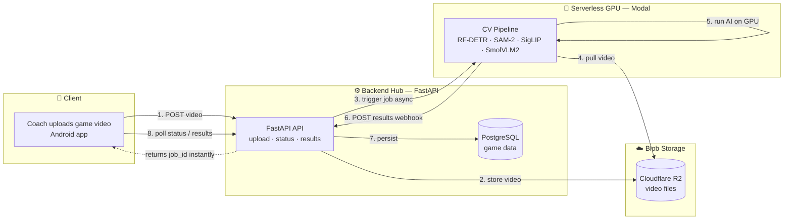
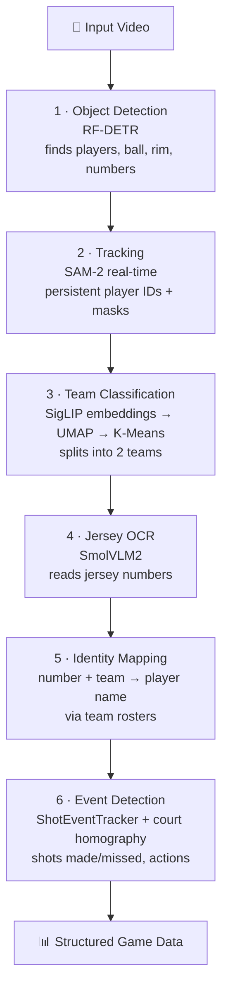
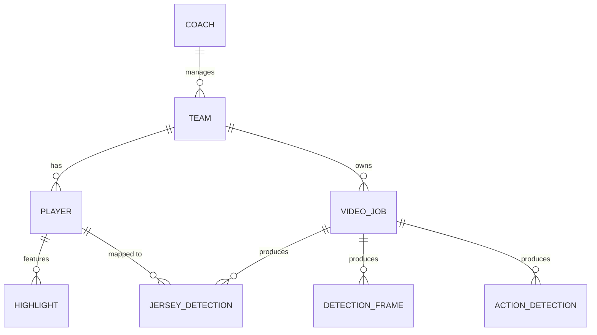
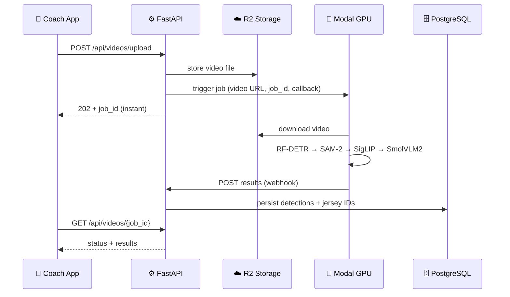

# StarHoop.ai 🏀 — Project Poster Content

> Complete, poster-ready content package: every section, the visuals (as diagrams you
> can recreate in Canva/PowerPoint/Figma), the wording, and the technical facts.
> Drawn from the actual codebase (`main.py`, the CV pipeline file, DB models, README)
> and the new **Modal** serverless GPU architecture.

> ⚠️ **Naming note:** The code title is **StarHoop.ai** (`FastAPI(title="StarHoop.ai API")`,
> README header) but the project folder and messages say **HoopStar.ai**. Pick one for
> the poster. This document uses **StarHoop.ai** — swap if you prefer HoopStar.ai.

---

## 1. Poster Title Block (top banner)

- **Project name:** **StarHoop.ai** 🏀
- **Tagline:** *"AI-powered basketball analytics for youth coaches."*
- **One-line description:** Upload a game video → AI automatically detects, tracks, and
  identifies every player by jersey number, team, and name → coaches get structured,
  queryable game data.
- **Audience:** Youth basketball coaches (players aged 6–13).
- **Delivery target:** Mobile app (Android / Google Play) backed by a cloud AI pipeline.

---

## 2. "What It Does" (problem → solution panel)

**The problem:** Youth coaches have hours of game footage but no easy way to turn it into
insights. Manually tracking who did what is slow and impractical.

**The solution:** StarHoop.ai ingests a raw basketball video and produces, fully
automatically:

- **Player detection** — finds every player in every frame.
- **Player tracking** — keeps a consistent ID for each player across the whole clip.
- **Team classification** — clusters players into their two teams by uniform.
- **Jersey number recognition (OCR)** — reads each player's number.
- **Player identity mapping** — matches numbers to real names via team rosters.
- **Action & shot events** — detects shooting/possession actions and made/missed shots.
- **Structured storage** — saves all of it to a database the coach app can query.

---

## 3. Core Architecture (main center graphic)

Production architecture (Colab → **Modal** migration). Use this as the central flow diagram:



**Key architectural idea to highlight:** *"Separation of concerns — a lightweight
always-on backend orchestrates, while a serverless GPU spins up only when a video needs
processing."*

---

## 4. The AI Pipeline (the "brains" panel — step-by-step)

Vertical pipeline of the **real models and stages** from the code:



**Detected classes (from the detector):** `ball`, `ball-in-basket`, `number`, `player`,
`player-in-possession`, `player-jump-shot`, `player-layup-dunk`, `player-shot-block`,
`referee`, `rim`.

**Smart details worth a callout box:**

- **SAM-2 is prompted by RF-DETR boxes** on the first frame, then propagates masks/IDs
  across all frames.
- **Team IDs are assigned once and reused** via track IDs → consistent colors/labels all game.
- **Consecutive-frame agreement** (`ConsecutiveValueTracker`) validates a jersey number
  only after it's read consistently → reduces OCR errors.
- **Court keypoint detection + homography** maps players onto a top-down court for shot positions.

---

## 5. Technology Stack (tools panel — group with logos)

| Layer | Technology | Role in the project |
|---|---|---|
| **Mobile Frontend** | Android Studio (Kotlin) | Coach-facing app: upload videos, view results |
| **Backend API** | **FastAPI** (Python) | Orchestration hub: upload, job status, results webhook |
| **ORM / Migrations** | SQLAlchemy + Alembic | Database models and schema versioning |
| **Database** | **PostgreSQL** (Docker) | Persists jobs, detections, jersey IDs, players, teams |
| **Serverless GPU** | **Modal** | On-demand GPU compute for the AI pipeline |
| **Blob Storage** | Cloudflare R2 (S3-compatible) | Stores uploaded video files |
| **Object Detection** | **RF-DETR** (Roboflow) | Detects players, ball, rim, numbers |
| **Tracking / Segmentation** | **SAM-2** (Meta, real-time fork) | Per-player masks + persistent IDs |
| **Team Classification** | **SigLIP** + UMAP + K-Means | Clusters players into two teams |
| **Jersey OCR** | **SmolVLM2** (Roboflow) | Reads jersey numbers |
| **CV Utilities** | Supervision, Roboflow `sports`, OpenCV, NumPy, PyTorch | Frame processing, court mapping, annotation |
| **Containerization** | Docker + Docker Compose | Reproducible local backend + DB |
| **Dev Tooling** | Git/GitHub, Pytest, ngrok (dev webhook) | Version control, tests, local webhook tunneling |

---

## 6. Data Model (database panel)

PostgreSQL schema — show as a simple entity diagram:



- **video_jobs** — one row per uploaded video (status: pending → processing →
  completed/failed, frame counts, throughput).
- **detection_frames** — per-frame detection results (JSON of boxes, track IDs, teams, numbers).
- **jersey_detections** — aggregated jersey number per track ID, mapped to a player.
- **action_detections** — detected actions/shots with timestamps.
- **players / teams / coaches / highlights** — roster and identity data.

---

## 7. Request Lifecycle (sequence panel — shows "how it all works")



**Live API endpoints (from the code):**

- `POST /api/videos/upload` — create a job
- `GET /api/videos/{job_id}` — poll status (`progress_percent`, `throughput_fps`)
- `POST /api/videos/{job_id}/results` — Modal results webhook *(evolved from the Colab
  ingestion endpoint)*
- `GET /health/` — health check

---

## 8. Migration Story (engineering journey callout)

> **From Prototype to Production:** The pipeline began in **Google Colab** (ephemeral
> notebooks, manual runs, ngrok tunnels). To make it a real, scalable application backend,
> GPU inference was migrated to **Modal serverless GPU** — durable, reproducible images,
> automatic scaling, and a clean webhook integration with FastAPI.

| | Prototype (before) | Production (now) |
|---|---|---|
| GPU compute | Google Colab (ephemeral) | Modal (serverless, scalable) |
| Environment | Manual `pip`/`git clone` per session | Cached, reproducible `modal.Image` |
| Connectivity | ngrok tunnel to laptop | HTTPS webhook to FastAPI |
| Reliability | Breaks on disconnect | Always-on, on-demand |

---

## 9. Suggested Poster Layout (how to arrange it all)

```
┌──────────────────────────────────────────────────────────┐
│  TITLE: StarHoop.ai 🏀   +   tagline   +   logo           │  ← Section 1
├───────────────┬──────────────────────────────────────────┤
│ WHAT IT DOES  │      CORE ARCHITECTURE DIAGRAM            │  ← 2 + 3
│ (problem/     │      (the big center graphic)            │
│  solution)    │                                          │
├───────────────┼───────────────────┬──────────────────────┤
│ AI PIPELINE   │  TECH STACK TABLE  │  DATA MODEL (ER)     │  ← 4 + 5 + 6
│ (6 stages)    │  (with logos)      │                      │
├───────────────┴───────────────────┴──────────────────────┤
│ REQUEST LIFECYCLE (sequence)  │  MIGRATION STORY callout  │  ← 7 + 8
├──────────────────────────────────────────────────────────┤
│ FOOTER: your name · course/team · date · GitHub/QR code   │
└──────────────────────────────────────────────────────────┘
```

---

## 10. Footer / Credits (fill in)

- **Created by:** *[your name]*
- **Context:** *[course / capstone / hackathon / personal project]*
- **Date:** June 2026
- **Repo / contact:** *[GitHub link or QR code]*

---

## Quick "elevator pitch" paragraph (prose for the poster)

> **StarHoop.ai** is an AI-powered basketball analytics platform for youth coaches. A coach
> simply uploads a game video from their phone; the system stores it in the cloud and triggers
> a serverless GPU pipeline that automatically detects and tracks every player, clusters them
> into teams, reads their jersey numbers, and maps them to real player names. The results —
> shots, actions, and per-player stats — are saved to a database and served back to the coach's
> app. Built on **FastAPI**, **PostgreSQL**, and **Modal serverless GPU**, and powered by
> state-of-the-art computer vision models (**RF-DETR**, **SAM-2**, **SigLIP**, **SmolVLM2**),
> StarHoop.ai turns raw footage into actionable insights — no manual tagging required.
